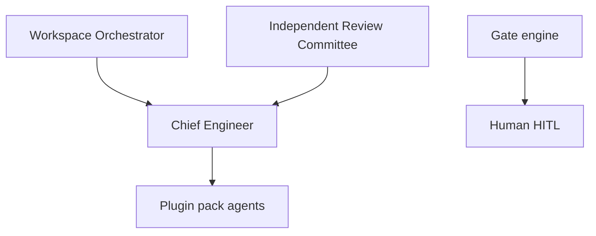

# Agentic-SDLC-AI — Platform Agent Registry

**Framework:** Plugin-adaptable agentic IDE + hybrid orchestration (procedural, LangGraph, ACP)  
**Charter:** [docs/charter/REBOOT_CHARTER.md](docs/charter/REBOOT_CHARTER.md)  
**Skills:** `platform/imports/` (staging) → `plugins/packs/*/skills/` (target)  
**Platform agents:** [agents/platform/PLATFORM_AGENTS.md](agents/platform/PLATFORM_AGENTS.md)

---

## Supervisor chain (target)

---

## HITL governance

| Gate mode | Meaning |
|-----------|---------|
| **mandatory** | Human must approve before proceed |
| **optional** | Agent may proceed; human can intervene |
| **waived** | Auto-pass with evidence log |
| **maturity-gated** | Mandatory at M2+ only |

Gate registry: `platform/gates/registry.yaml`

---

## Slash commands (via Grok Build)

| Command | Skill (target) |
|---------|----------------|
| `/orchestrate-sdlc` | orchestrate-sdlc |
| `/review-sdlc` | independent-review-sdlc |
| `/threat-model` | threat-modeling pack |

---

## Revision history

| Version | Date | Change |
|---------|------|--------|
| 0.2.0 | 2026-06-06 | Platform reboot scaffold; imports from FarmRTK + MATM |