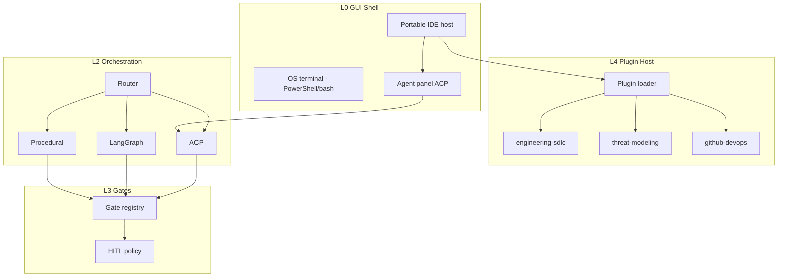

# Framework Decomposition — Severable Objects

**Parent:** [REBOOT_CHARTER.md](REBOOT_CHARTER.md)

---

## Layer model

| Layer | ID | Responsibility | Severable artifact |
|-------|-----|----------------|-------------------|
| **L0** | `gui-shell` | Editor host, terminals, layout, settings | `gui/` |
| **L1** | `agent-runtime` | ACP, Grok Build, tool permissions | `src/platform/orchestration/acp/` |
| **L2** | `orchestration` | Router: procedural / LangGraph / ACP | `src/platform/orchestration/` |
| **L3** | `gate-engine` | HITL policies, evidence, enforce hooks | `src/platform/gates/` |
| **L4** | `plugin-host` | Load packs, providers, viewers, toolchains | `src/platform/plugins/` |
| **L5** | `workspace` | Multi-repo manifest, maturity, providers | `workspace/` |
| **L6** | `providers` | LLM + GitHub + secrets | `src/platform/providers/` |
| **L7** | `packs` | Domain capabilities | `plugins/packs/` |
| **L8** | `product-repo` | Application source (external) | FarmRTK, customer apps |

---

## Severable object catalog

### Core platform objects

| Object | Path | Contract |
|--------|------|----------|
| **Platform manifest** | `platform/manifest.yaml` | Version, min Python, supported OS |
| **Skill contract schema** | `platform/schemas/skill-contract.schema.json` | Inputs, outputs, policy checks |
| **Plugin manifest schema** | `platform/schemas/plugin-manifest.schema.json` | Pack metadata, entrypoints |
| **Gate registry** | `platform/gates/registry.yaml` | Gate id, mode, executor, viewer |
| **Agent registry** | `agents/platform/PLATFORM_AGENTS.md` | RRA, skills, readiness |
| **Workspace schema** | `platform/schemas/workspace.schema.json` | Repos, packs, gates, toolchains |

### Plugin object (pack)

```yaml
# plugins/packs/<pack-id>/plugin.manifest.yaml
id: engineering-sdlc
version: 0.1.0
type: pack
entry:
  skills_dir: skills
  agents_dir: agents
toolchains: [platformio, arduino-cli]
languages: [c, cpp, python]
os: [windows, linux, macos]
dependencies:
  packs: []
  providers: [grok-build]
```

### Viewer object

| Viewer id | Work product | Path |
|-----------|--------------|------|
| `viewer.markdown` | REQ, docs, ADR | `gui/viewers/markdown/` |
| `viewer.mermaid` | Architecture, threat diagrams | `gui/viewers/mermaid/` |
| `viewer.stix` | Threat bundles | `gui/viewers/stix/` |
| `viewer.icd-csv` | Interface tables | `gui/viewers/icd-csv/` |
| `viewer.graph-canonical` | MATM canonical JSON | `gui/viewers/graph-canonical/` |
| `viewer.lsp` | Code (all languages) | `gui/shell/` (delegates to host) |

### Provider object

| Provider id | Capability |
|-------------|------------|
| `provider.grok-build` | ACP agent stdio |
| `provider.grok-api` | xAI API BYOK |
| `provider.openai` | OpenAI-compatible |
| `provider.github` | Repos, Actions, PRs, `gh` CLI |
| `provider.ollama` | Local inference (optional) |

### Toolchain plugin object

Supports: JavaScript/Node, CakePHP/PHP, Rust/cargo, C/C++/CMake, Java/Maven/Gradle, Fortran, Python.

Each toolchain declares: detect files, build cmd, test cmd, lint cmd, CI template.

---

## Decomposition diagram



---

## Language / framework adaptability

| Stack | Detection | Toolchain plugin | CI template pack |
|-------|-----------|------------------|------------------|
| JavaScript / TS | `package.json` | `toolchain.node` | `github-devops/workflows/node.yml` |
| CakePHP / PHP | `composer.json` | `toolchain.php` | `php.yml` |
| Rust | `Cargo.toml` | `toolchain.rust` | `rust.yml` |
| C / C++ | `CMakeLists.txt`, `Makefile` | `toolchain.cmake` | `cpp.yml` |
| Java | `pom.xml`, `build.gradle` | `toolchain.java` | `java.yml` |
| Fortran | `CMakeLists.txt`, `.f90` | `toolchain.fortran` | `fortran.yml` |
| Python | `pyproject.toml` | `toolchain.python` | `python.yml` |
| Embedded | `platformio.ini` | `toolchain.platformio` | `platformio.yml` |

---

## GitHub linkage

| Feature | Implementation |
|---------|----------------|
| Clone/open repo | Workspace manifest `repos[].url` |
| PR checks | `github-devops` pack → gate enforce at merge |
| Actions | Template workflows per toolchain |
| Evidence | Store run URLs in gate evidence bundle |
| Agent tasks | `gh pr create`, `gh workflow run` via procedural skills |

---

## Revision history

| Rev | Date | Change |
|-----|------|--------|
| 0.1 | 2026-06-06 | Initial decomposition scaffold |