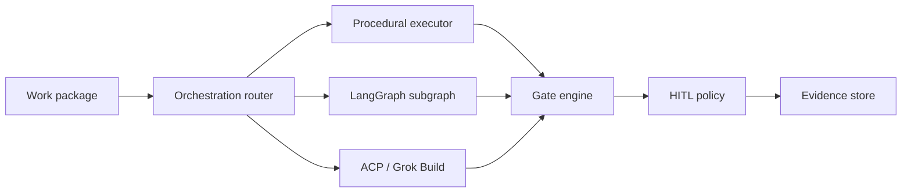

# Agentic-SDLC-AI Platform Reboot Charter

**Document ID:** CHARTER-001  
**Version:** 1.0.0  
**Date:** 2026-06-06  
**Status:** Approved for scaffold — implementation in progress

---

## 1. Purpose

Reboot **Agentic-SDLC-AI** as a **standalone, plugin-adaptable agentic IDE platform** for assured systems engineering and software development — not a single-product repo.

Application repos (FarmRTK, MATM runtime, web apps, embedded, etc.) become **workspace targets** and **plugin packs**. The platform owns process, gates, orchestration, viewers, and core SE agents.

---

## 2. Guiding principles

| Principle | Meaning |
|-----------|---------|
| **Plugin-first** | Capabilities ship as severable plugins/packs; core stays thin |
| **HITL by policy** | Gates are `mandatory`, `optional`, `waived`, or `maturity-gated` per workspace |
| **Hybrid orchestration** | Procedural skills, LangGraph subgraphs, and ACP (Grok Build) coexist |
| **Multi-surface** | Same platform on Windows, Linux, macOS; shell = PowerShell or bash per OS |
| **Multi-language** | JS/TS, PHP, Rust, C/C++, Java, Fortran, Python — via LSP + pack toolchains |
| **GitHub-native** | Repos, Actions, PRs, and checks are first-class work products |
| **Evidence over vibes** | Every gate produces auditable artifacts |

---

## 3. What we keep from legacy Agentic-SDLC-AI

- LangGraph supervisor, gate nodes, checkpoint persistence
- HITL utilities (`src/utils/hitl.py`)
- Skill contract schema (`src/skills/contracts.py`)
- Model router (`src/routing/model_router.py`)
- KPI tracker, work packages, agent RRA concepts

## 4. What we gut or demote

| Legacy | Action |
|--------|--------|
| Ollama-only as default narrative | Demote to optional provider in `providers/ollama` |
| Streamlit as primary IDE | Demote to viewer plugin; MATM wrapper uses it |
| VS Code-centric getting started | Replace with Zed ACP + portable shell (`gui/`) |
| Monolithic 12 agents doing domain work | Platform agents only; domain → packs |
| Duplicate FarmRTK/MATM implementations | Import + generalize (see `REFACTOR_TODO.md`) |

---

## 5. Severable decomposition (top level)

```
Agentic-SDLC-AI/
├── docs/charter/           # This charter, refactor map, decomposition
├── platform/               # Severable: registry, imports, schemas (no runtime deps on apps)
├── plugins/                # Severable: packs + plugin SDK + templates
├── gui/                    # Severable: portable IDE shell, viewers, installer
├── workspace/              # Severable: workspace manifest templates
├── agents/platform/        # Platform agent personas (not domain)
├── src/platform/           # Python runtime: orchestration, gates, plugin loader
├── src/ (legacy)           # Existing LangGraph agents — bridge during migration
└── tools/install/          # Bootstrap scripts (PowerShell primary)
```

---

## 6. Orchestration model (hybrid)



| Executor | When |
|----------|------|
| **Procedural** | Audits, CI scripts, wave plan, one-shot skills |
| **LangGraph** | Stateful pipelines, selective rerun, canonical artifacts (MATM-style) |
| **ACP** | Interactive IDE sessions, human-paired implementation |

---

## 7. Plugin taxonomy

| Type | Example | Severable |
|------|---------|-----------|
| **Pack** | `engineering-sdlc`, `threat-modeling` | Yes — `plugins/packs/` |
| **Provider** | Grok, OpenAI, GitHub | Yes — `src/platform/providers/` |
| **Viewer** | Mermaid, STIX, ICD CSV, markdown | Yes — `gui/viewers/` |
| **Toolchain** | PlatformIO, npm, cargo, maven | Yes — pack manifest |
| **Wrapper** | MATM API, FarmRTK `Tools/ci` | Yes — plugin entrypoint |

---

## 8. Imported sources (scaffold copy)

| Source repo | Copied to | Role |
|-------------|-----------|------|
| FarmRTK (17 skills) | `platform/imports/farmrtk/skills/` | Generalize → platform SE pack |
| FarmRTK (5 domain skills) | `plugins/packs/engineering-sdlc/imports/` | Reference until extracted |
| MATM (26 skills, 24 agents) | `platform/imports/matm/` | Governance + threat pack seed |

See `platform/imports/IMPORT_MANIFEST.md`.

---

## 9. Phases

| Phase | Deliverable |
|-------|-------------|
| **R0** (this commit) | Charter, scaffold, imports, refactor map |
| **R1** | Plugin loader + gate registry + workspace manifest validator |
| **R2** | Generalized skills (rename `*-farmrtk` → `*-sdlc`) |
| **R3** | MATM wrapper plugin + STIX/Mermaid viewers |
| **R4** | GUI shell (Zed kit → portable host) |
| **R5** | GitHub DevOps pack (Actions, PR checks, stack workflows) |
| **R6** | Installer + downloadable workspace kit |

---

## 10. Success criteria

- [ ] FarmRTK usable as workspace target without duplicating platform agents
- [ ] MATM invocable as plugin without forking runtime
- [ ] New JS or Rust repo onboarded via workspace template only
- [ ] Gates enforceable at commit, merge, and release
- [ ] Grok Build ACP + PowerShell terminal documented install path

---

## Revision history

| Rev | Date | Change |
|-----|------|--------|
| 1.0.0 | 2026-06-06 | Initial reboot charter; scaffold commit |