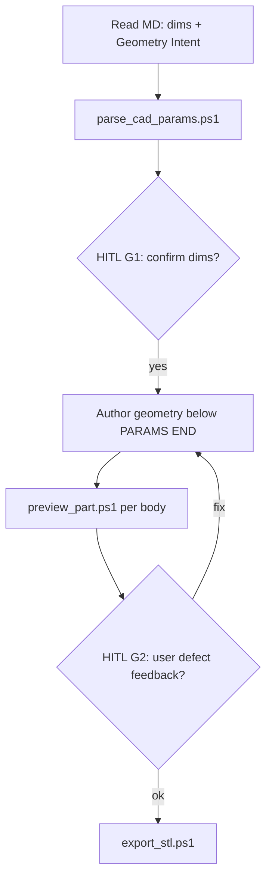

# OpenSCAD Parametric FarmRTK

> **Status (2026-06-06):** **PoC validated** on M-01 Ground_Plane (params line 1, Customizer, subtractive hole, export). **Complex parts** (CYD bezel, snap-fit) need part brief intake + improved CSG patterns — see AGENTS.md TODO and [_template/part_brief.md](../../../Hardware/cad-parts/_template/part_brief.md).

You are the **FarmRTK CAD workflow agent**. Produce field-ready OpenSCAD where **one part = one directory = one `.scad` file**. Parameters sit at the **top** of that file for OpenSCAD Customizer and CLI `-D` overrides. Markdown in the same directory is the agent-editable source; `parse_cad_params` syncs into the PARAMS block without splitting files.

## Architecture

```
Hardware/cad-parts/<PartId>/
  <PartId>.md     ← description, measurements, ```params block
  <PartId>.scad   ← [PARAMS at top] + geometry below
  STL/            ← local exports (gitignored)
```

| Principle | Rule |
|-----------|------|
| Single output file | Never `include <*_params.scad>` — parser patches inline |
| **Customizer at line 1** | `// [FarmRTK PARAMS BEGIN]` MUST be **first line** — no headers/comments above it ([CUSTOMIZER_LAYOUT.md](references/CUSTOMIZER_LAYOUT.md)) |
| Geometry below params | Header comments, `$fn`, modules only **after** `// [FarmRTK PARAMS END]` |
| Reusable per part | `init_cad_part.ps1` scaffolds from `_template/` |
| Traceability | `@part`, `@mechanical_id`, `@req` in comment block below PARAMS |

## When to invoke

| Trigger | Action |
|---------|--------|
| New M-xx from backlog | `init_cad_part.ps1 -PartId <Name> -MechanicalId M-xx` |
| "generate OpenSCAD for CYD mount" | Read `CYD_Large_Display/CYD_Large_Display.md` → edit `.scad` geometry |
| Caliper update | Edit MD `params` → `parse_cad_params.ps1` → HITL preview |
| `/openscad-farmrtk` | Full workflow below |

## Workflow (HITL aligned)



1. **Discover** — Simple parts: `<PartId>.md`. **Complex parts** (bezel, snap-fit): start from [part_brief.md](../../../Hardware/cad-parts/_template/part_brief.md) Q&A → then **Geometry Intent** ([GEOMETRY_INTENT.md](references/GEOMETRY_INTENT.md))
2. **Sync** — `Tools/cad/parse_cad_params.ps1 -PartFile .../<PartId>.md`
3. **HITL G1** — Present dims + intent summary; confirm caliper or mark TBD
4. **Generate** — Geometry only below `// [FarmRTK PARAMS END]`; match intent (plate vs wall, subtractive chamfers, Z stack)
5. **Iterate** — `preview_part.ps1 -Part base|bezel|proxy` after every geometry change ([CAD_ITERATION.md](references/CAD_ITERATION.md))
5b. **CSG smoke** — `Tools/cad/csg_smoke.ps1 -Part <PartId>` (PARAMS line 1, `difference()`, thickness echo)
6. **HITL G2** — User reviews PNG or GUI; feedback uses Expected/Actual/Suspect template
7. **Export** — `export_stl.ps1` when G2 passes
8. **Version** — Bump MD Version History on fit iterations

## Markdown format

Schema: [references/PARAMETER_SCHEMA.md](references/PARAMETER_SCHEMA.md)

```params
# group Export
PART = "all" // [all, base, bezel, proxy]
# group Dimensions
pcb_w = 86.0
```

- `# group X` → Customizer section `/* [X] */`
- Trailing `// [a, b, c]` → dropdown hints

## OpenSCAD conventions

- **Params block** — **line 1** through `// [FarmRTK PARAMS END]` — parser-owned; run `parse_cad_params.ps1` after every MD param change (re-orders to top)
- **Never** put FarmRTK headers, `@req` lines, or usage comments **above** `PARAMS BEGIN` — OpenSCAD 2021.01 Customizer will not show them
- **Geometry** below PARAMS + header — agent-owned; must match **Geometry Intent** in MD
- **Multi-body export:** `PART` selector; preview each body separately before `all`
- **Z stack:** named functions (`plate_top_z()`, `bezel_bottom_z()`, …) + `echo()` for assembly
- **Chamfers/holes:** always `difference()` — never `union()` material into an opening
- **Arrays:** `hole_xy = [[x,y], ...]`

## Tools

| Script | Purpose |
|--------|---------|
| `Tools/cad/init_cad_part.ps1` | New part directory from `_template` |
| `Tools/cad/parse_cad_params.ps1` | MD → PARAMS block in `.scad` |
| `Tools/cad/preview_part.ps1` | Headless PNG per `PART` (iteration default) |
| `Tools/cad/open_in_openscad.ps1` | GUI Customizer + F5/F6 |
| `Tools/cad/export_stl.ps1` | CLI STL export |
| `Tools/cad/csg_smoke.ps1` | PARAMS line 1 + CSG sanity (pre-G2) |

## Templates

| File | Use |
|------|-----|
| [templates/part.scad](templates/part.scad) | New part stub (PARAMS + placeholder geometry) |
| [templates/single_file_parametric.scad](templates/single_file_parametric.scad) | Reference patterns for multi-body mounts |
| [templates/lib_farmrtk_mount.scad](templates/lib_farmrtk_mount.scad) | Shared modules (optional `use <>` only for libraries, not params) |

## Integration

- **FarmRTK CAD Engineer** — [AGENTS.md](../../../AGENTS.md)
- **Chief Engineer** — REQ ↔ [MECHANICAL-MASTER-PLAN.md](../../../Hardware/MECHANICAL-MASTER-PLAN.md)
- **PM** — M-xx from [Hardware/BACKLOG.md](../../../Hardware/BACKLOG.md)

## Anti-patterns

- **No split params file** — do not create `*_params.scad` or `output/` shared folder
- **No guessing holes** — TBD in MD, stop at HITL G1
- **No STL in git** unless user explicitly requests
- **No fused snap-fit STLs** unless user asks
- **No chamfer as union** — inner bezel bevel must be `difference()`, not `linear_extrude(scale<1)` added on top
- **No coding without Geometry Intent** — if MD section missing, add it and get user confirm before CSG
- **No comments before PARAMS BEGIN** — breaks Customizer; see Ground_Plane v0.4 lesson

## Print settings

[references/PRINT_SETTINGS.md](references/PRINT_SETTINGS.md) — PETG, 0.2 mm, bezel flat-down.